# Diagram Przepływu Autentykacji - StrummerBox

## Diagram Sekwencji Autentykacji

```mermaid
sequenceDiagram
    autonumber
    participant Przeglądarka
    participant SPA as Angular SPA
    participant AuthService
    participant SupabaseClient as Supabase Auth
    participant API as Deno Functions API

    Note over Przeglądarka,API: Scenariusz 1: Logowanie użytkownika

    Przeglądarka->>SPA: Otwórz /login
    SPA->>Przeglądarka: Wyświetl LoginComponent

    Przeglądarka->>SPA: Wypełnij formularz i kliknij zaloguj
    SPA->>SupabaseClient: signInWithPassword(email, password)
    SupabaseClient->>SupabaseClient: Weryfikuj credentials
    
    alt Credentials poprawne
        SupabaseClient-->>SPA: Session (access_token, refresh_token)
        SPA->>SPA: ProfileService.reset()
        SPA->>Przeglądarka: Przekieruj do /management/dashboard
    else Credentials niepoprawne
        SupabaseClient-->>SPA: AuthError
        SPA->>Przeglądarka: Wyświetl komunikat błędu
    end

    Note over Przeglądarka,API: Scenariusz 2: Dostęp do chronionej trasy

    Przeglądarka->>SPA: Nawiguj do /management/dashboard
    SPA->>SPA: AuthGuard sprawdza dostęp
    SPA->>SPA: ProfileService.loadProfile()
    SPA->>SupabaseClient: getSession()
    
    alt Sesja istnieje
        SupabaseClient-->>SPA: Session (access_token)
        SPA->>API: GET /me/profile + Bearer token
        API->>API: Weryfikuj JWT token
        
        alt Token ważny
            API->>API: Pobierz dane profilu z bazy
            API-->>SPA: OrganizerProfileDto
            SPA->>SPA: Zapisz profil w serwisie
            SPA->>Przeglądarka: Wyświetl DashboardComponent
        else Token nieważny
            API-->>SPA: 401 Unauthorized
            SPA->>Przeglądarka: Przekieruj do /login
        end
    else Brak sesji
        SupabaseClient-->>SPA: null
        SPA->>Przeglądarka: Przekieruj do /login
    end

    Note over Przeglądarka,API: Scenariusz 3: Wylogowanie

    Przeglądarka->>SPA: Kliknij wyloguj w ToolbarComponent
    SPA->>AuthService: logout()
    AuthService->>SupabaseClient: signOut()
    SupabaseClient->>SupabaseClient: Usuń sesję i tokeny
    SupabaseClient-->>AuthService: Sukces
    AuthService->>SPA: ProfileService.reset()
    AuthService->>SPA: Router.navigate(['/login'])
    SPA->>Przeglądarka: Przekieruj do /login

    Note over Przeglądarka,API: Scenariusz 4: Automatyczne odświeżanie tokenu

    SPA->>SupabaseClient: Wykonaj żądanie po 55 min
    SupabaseClient->>SupabaseClient: Sprawdź ważność access_token
    
    alt Token wygasł
        SupabaseClient->>SupabaseClient: Użyj refresh_token
        SupabaseClient->>SupabaseClient: Wygeneruj nowy access_token
        SupabaseClient->>SupabaseClient: Zapisz nową sesję
        SupabaseClient-->>SPA: Nowy access_token
    else Token ważny
        SupabaseClient-->>SPA: Obecny access_token
    end

    Note over Przeglądarka,API: Scenariusz 5: Rejestracja nowego użytkownika

    Przeglądarka->>SPA: Otwórz /register
    SPA->>Przeglądarka: Wyświetl RegisterComponent

    Przeglądarka->>SPA: Wypełnij formularz i kliknij zarejestruj
    SPA->>AuthService: signUp(email, password)
    AuthService->>SupabaseClient: auth.signUp()
    SupabaseClient->>SupabaseClient: Waliduj dane
    
    alt Dane poprawne i email nie istnieje
        SupabaseClient->>SupabaseClient: Utwórz użytkownika w auth.users
        SupabaseClient->>SupabaseClient: Trigger: Utwórz profil
        SupabaseClient->>SupabaseClient: Wyślij email weryfikacyjny
        SupabaseClient-->>AuthService: Session + User
        AuthService-->>SPA: Sukces
        SPA->>Przeglądarka: Przekieruj do /management/dashboard
        SPA->>Przeglądarka: Wyświetl info o weryfikacji email
    else Email już istnieje
        SupabaseClient-->>AuthService: AuthError
        AuthService-->>SPA: Błąd
        SPA->>Przeglądarka: Wyświetl komunikat błędu
    end

    Note over Przeglądarka,API: Scenariusz 6: Odzyskiwanie hasła

    Przeglądarka->>SPA: Otwórz /forgot-password
    SPA->>Przeglądarka: Wyświetl ForgotPasswordComponent

    Przeglądarka->>SPA: Podaj email i kliknij wyślij
    SPA->>AuthService: recoverPassword(email)
    AuthService->>SupabaseClient: resetPasswordForEmail()
    SupabaseClient->>SupabaseClient: Wygeneruj token resetujący
    SupabaseClient->>Przeglądarka: Wyślij email z linkiem
    SupabaseClient-->>AuthService: Sukces
    AuthService-->>SPA: Sukces
    SPA->>Przeglądarka: Wyświetl komunikat o wysłaniu linku

    Przeglądarka->>Przeglądarka: Użytkownik klika link w emailu
    Przeglądarka->>SPA: Otwórz /update-password z tokenem
    SPA->>Przeglądarka: Wyświetl UpdatePasswordComponent

    Przeglądarka->>SPA: Podaj nowe hasło i zatwierdź
    SPA->>AuthService: updatePassword(newPassword)
    AuthService->>SupabaseClient: updateUser(password)
    SupabaseClient->>SupabaseClient: Weryfikuj token z URL
    
    alt Token ważny
        SupabaseClient->>SupabaseClient: Zaktualizuj hasło
        SupabaseClient-->>AuthService: Sukces
        AuthService-->>SPA: Sukces
        SPA->>Przeglądarka: Przekieruj do /login
        SPA->>Przeglądarka: Wyświetl komunikat o sukcesie
    else Token nieważny lub wygasły
        SupabaseClient-->>AuthService: AuthError
        AuthService-->>SPA: Błąd
        SPA->>Przeglądarka: Wyświetl komunikat błędu
    end
```

<mermaid_diagram>

</mermaid_diagram>

## Kluczowe Elementy Architektury

### Komponenty Frontend (Angular SPA)

1. **LoginComponent** (`src/app/pages/login/`)
   - Formularz logowania z walidacją
   - Obsługa signInWithPassword
   - Przekierowanie po sukcesie

2. **RegisterComponent** (`src/app/pages/register/`) - planowany
   - Formularz rejestracji
   - Walidacja email i hasła
   - Informacja o weryfikacji email

3. **ForgotPasswordComponent** (`src/app/pages/forgot-password/`) - planowany
   - Formularz z emailem
   - Inicjowanie procesu resetu

4. **UpdatePasswordComponent** (`src/app/pages/update-password/`) - planowany
   - Formularz nowego hasła
   - Obsługa tokenu z URL

5. **ToolbarComponent** (`src/app/layout/toolbar/`)
   - Wyświetlanie stanu użytkownika
   - Przycisk wylogowania

### Serwisy

1. **AuthService** (`src/app/core/services/auth.service.ts`)
   - Centralne zarządzanie autentykacją
   - Metody: logout, signUp, signIn, recoverPassword, updatePassword
   - Reaktywne strumienie stanu

2. **SupabaseService** (`src/app/core/services/supabase.service.ts`)
   - Konfiguracja klienta Supabase
   - PKCE flow
   - Automatyczne odświeżanie tokenów

3. **ProfileService** (`src/app/core/services/profile.service.ts`)
   - Zarządzanie danymi profilu
   - Pobieranie profilu z API
   - Sygnały reaktywne

### Guards

1. **AuthGuard** (`src/app/core/guards/auth.guard.ts`)
   - Ochrona tras wymagających logowania
   - Weryfikacja przez ProfileService
   - Przekierowanie do /login

2. **PublicGuard** (planowany)
   - Ochrona tras logowania/rejestracji
   - Przekierowanie zalogowanych do /dashboard

### Backend (Supabase + Deno Functions)

1. **Supabase Auth**
   - Zarządzanie użytkownikami
   - Tokeny JWT
   - Email verification
   - Password reset

2. **API Endpoint `/me/profile`**
   - Weryfikacja JWT
   - Zwracanie danych profilu
   - Middleware requireAuth

## Konfiguracja Bezpieczeństwa

- **Flow Type**: PKCE (Proof Key for Code Exchange)
- **Session Persistence**: Tak, w Local Storage
- **Auto Refresh**: Tak, automatyczne odświeżanie tokenów
- **Token Expiry**: Access token ~60 min, Refresh token ~30 dni
- **Session Detection**: Wykrywanie sesji w URL dla magic links

